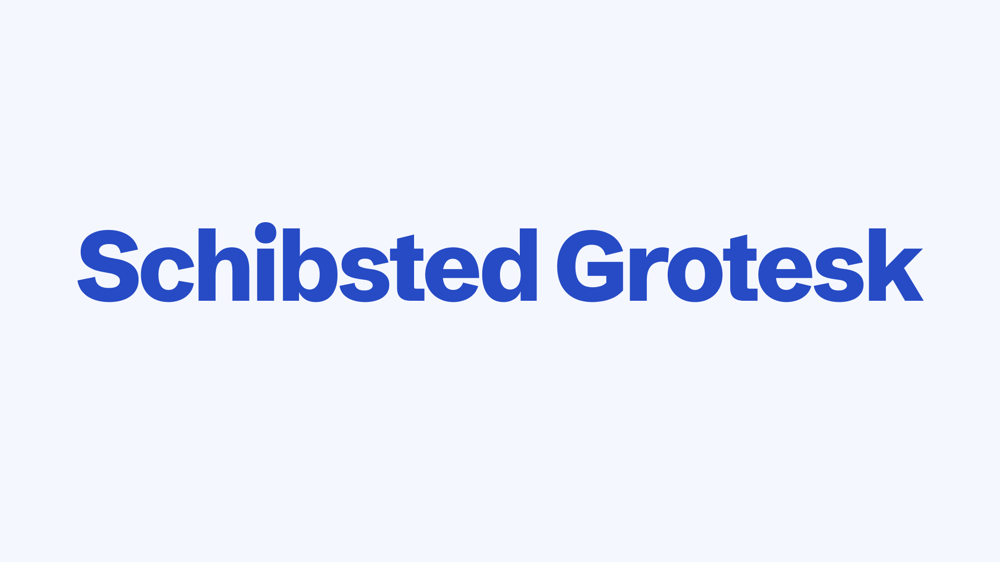
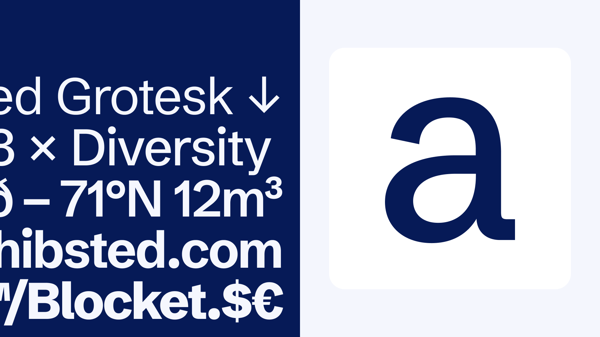

# Schibsted Grotesk

[![][Fontbakery]](https://schibsted.github.io/schibsted-grotesk/fontbakery/fontbakery-report.html)
[![][Universal]](https://schibsted.github.io/schibsted-grotesk/fontbakery/fontbakery-report.html)
[![][GF Profile]](https://schibsted.github.io/schibsted-grotesk/fontbakery/fontbakery-report.html)
[![][Shaping]](https://schibsted.github.io/schibsted-grotesk/fontbakery/fontbakery-report.html)

[Fontbakery]: https://img.shields.io/endpoint?url=https%3A%2F%2Fraw.githubusercontent.com%2Fschibsted%2Fschibsted-grotesk%2Fgh-pages%2Fbadges%2Foverall.json
[GF Profile]: https://img.shields.io/endpoint?url=https%3A%2F%2Fraw.githubusercontent.com%2Fschibsted%2Fschibsted-grotesk%2Fgh-pages%2Fbadges%2FGoogleFonts.json
[Outline Correctness]: https://img.shields.io/endpoint?url=https%3A%2F%2Fraw.githubusercontent.com%2Fschibsted%2Fschibsted-grotesk%2Fgh-pages%2Fbadges%2FOutlineCorrectnessChecks.json
[Shaping]: https://img.shields.io/endpoint?url=https%3A%2F%2Fraw.githubusercontent.com%2Fschibsted%2Fschibsted-grotesk%2Fgh-pages%2Fbadges%2FShapingChecks.json
[Universal]: https://img.shields.io/endpoint?url=https%3A%2F%2Fraw.githubusercontent.com%2Fschibsted%2Fschibsted-grotesk%2Fgh-pages%2Fbadges%2FUniversal.json

Schibsted Grotesk is a digital-first font family crafted for user interfaces. Taking visual cues from Schibsted’s proud history of printed media as well as our pioneering digital nature, Schibsted Grotesk was designed to become an active tool that empowers brand ambassadors and inspires internal and external audiences.

Schibsted Grotesk covers the Underware Latin Plus character set, using 4 masters distributed across weights and italics.

## About
Schibsted Grotesk was created by [Bakken & Bæck](https://bakkenbaeck.com) for [Schibsted](https://schibsted.com).

Schibsted is a family of digital brands with a mission to empower people in their daily lives. We do this by providing leading online marketplaces, building world-class media houses, and helping great companies scale.

## Building

Fonts are built automatically by GitHub Actions - take a look in the "Actions" tab for the latest build.

If you want to build fonts manually on your own computer:

* `make build` will produce font files.
* `make test` will run [FontBakery](https://github.com/googlefonts/fontbakery)'s quality assurance tests.
* `make proof` will generate HTML proof files.

The proof files and QA tests are also available automatically via GitHub Actions - look at https://schibsted.github.io/schibsted-grotesk.

## Changelog

**13 February 2023. Version 1.100**
- Adapted to Google Fonts specifications

## License

This Font Software is licensed under the SIL Open Font License, Version 1.1.
This license is available with a FAQ at
https://scripts.sil.org/OFL

## Repository Layout

This font repository structure is inspired by [Unified Font Repository v0.3](https://github.com/unified-font-repository/Unified-Font-Repository), modified for the Google Fonts workflow.
